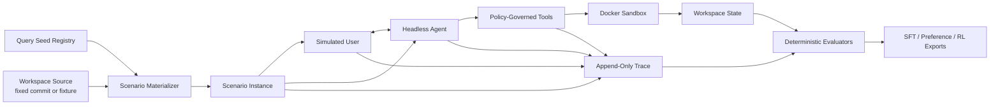

<div align="center">

# Easy Agentic Data

**Build reproducible, verifiable agent trajectories for post-training.**

A lightweight, headless framework that lets an LLM act as a user, another LLM act as an agent,
and sandboxed tools turn their interaction into training data.

[](https://www.python.org/)
[](LICENSE)
[](tests/)
[](PLAN.md)

[Quick Start](#quick-start) · [Architecture](#architecture) · [Local Models](#local-llm-api) ·
[Documentation](#documentation)

</div>

---

Easy Agentic Data generates executable agent interaction data rather than isolated prompt-response
pairs. It binds a query seed to a reproducible workspace, runs a tool-using agent inside a
restricted environment, optionally simulates multi-turn user behavior, evaluates the resulting
state, and preserves the complete trajectory for downstream training.

```text
query seed + workspace
        |
        v
simulated user <-> headless agent <-> sandboxed tools
                                      |
                                      v
                         deterministic evaluation
                                      |
                                      v
                    SFT / preference / RL datasets
```

## Why This Project?

High-quality agent data needs more than fluent model output. It needs environments that can be
reset, tools that can be governed, outcomes that can be checked, and traces that can be replayed.

- **Environment-grounded**: Final workspace state and executable checks are the primary signals.
- **Reproducible**: Seeds, immutable environment references, model settings, and tool events are
  recorded.
- **Verification-first**: Hard failures cannot be hidden by a high model-judge score.
- **Provider-neutral**: Hosted and locally deployed OpenAI-compatible APIs share one interface.
- **Training-neutral**: Export standard JSONL for SFT, preference optimization, and RL workflows.
- **Headless by design**: No UI or browser automation is required for the core synthesis loop.

## Capabilities

| Area | Included |
| --- | --- |
| Agent runtime | Multi-turn model loop, function tools, user questions, bounded retries |
| Sandboxing | Rootless Docker, resource limits, read-only root filesystem, network policy |
| Scenario registry | Query seeds, public and hidden context, fixed environment sources |
| User simulation | Rule-based and LLM-backed simulated users |
| Tracing | Versioned append-only JSONL events, artifact storage, deterministic replay |
| Evaluation | Hidden commands, required state, forbidden state, policy integrity |
| Dataset construction | SFT, chosen/rejected preference pairs, RL and analysis exports |
| Batch execution | Persistent jobs, retries, resume, budgets, rate limits, call cache |
| Governance | Sensitive-data scanning, retention controls, leakage validation |

## Architecture



The public task context is separated from hidden user and evaluator context. Hidden answers are
never placed in agent prompts or public trace events. See the
[trace schema](docs/trace-schema.md) and [threat model](docs/threat-model.md) for the exact
boundaries.

## Quick Start

### 1. Run the reproducible demo

The core package requires only Python 3.10+ and the standard library.

```bash
git clone https://github.com/COK-ZhangZiliang/Easy-Agentic-Data.git
cd Easy-Agentic-Data

PYTHONPATH=src python3 -m easy_agentic_data.cli run \
  --config examples/minimal.json
```

The mock-backed demo writes a complete local run under `runs/local-demo/`, so it does not require
an API key or network access.

```text
runs/local-demo/
├── manifest.json
├── llm_calls.jsonl
├── tasks.jsonl
├── trajectories.jsonl
├── sft.jsonl
└── preferences.jsonl
```

### 2. Install the development command

```bash
python3 -m pip install -e '.[dev]'
ead run --config examples/minimal.json
```

### 3. Run the tests

```bash
PYTHONPATH=src python3 -m unittest discover -s tests -v
```

## Local LLM API

Use `local_openai_compatible` with a local or private chat-completions server such as vLLM,
SGLang, llama.cpp, or an OpenAI-compatible Ollama deployment:

```bash
PYTHONPATH=src python3 -m easy_agentic_data.cli run \
  --config examples/local-openai-compatible.json
```

```json
{
  "provider": "local_openai_compatible",
  "model": "Qwen/Qwen3-8B",
  "base_url": "http://127.0.0.1:8000/v1",
  "api_key_env": null,
  "chat_completions_path": "/chat/completions"
}
```

Authentication is optional. Set `api_key_env` to an environment variable name when the endpoint
requires a Bearer token. Tool-use trajectories require the serving stack and chat template to
support OpenAI function calling.

For a hosted OpenAI-compatible endpoint:

```bash
export OPENAI_API_KEY=...
ead run --config examples/openai-compatible.json
```

## Sandboxed Agent Runs

Agent and batch runs use rootless Docker. A scenario binds the agent query to an immutable
environment source, capability policy, hidden evaluator checks, and reset procedure.

```bash
ead registry validate --root registry/
ead registry list --root registry/

ead agent-run \
  --registry registry/ \
  --scenario-id scenario_... \
  --config examples/local-openai-compatible.json \
  --trace runs/agent.jsonl
```

Replay a trace without calling a model or executing a tool:

```bash
ead replay --trace runs/agent.jsonl
```

### Docker on macOS

The validated macOS setup uses Docker CLI with Colima:

```bash
brew install docker colima
colima start --cpu 2 --memory 4 --disk 20 --vm-type vz

EAD_RUN_DOCKER_TESTS=1 PYTHONPATH=src \
  python3 -m unittest tests.test_docker_integration -v
```

`MemorySandbox` is used by unit tests for speed. It is not a production security boundary.

## Batch Synthesis

The persistent scheduler supports idempotent jobs, retries, interrupted-run recovery, budgets,
rate limits, health checks, and cached model calls.

```bash
ead batch enqueue \
  --registry registry/ \
  --database runs/jobs.sqlite3 \
  --model local-model \
  --config-hash config-v1 \
  --rollouts 4

ead batch run \
  --registry registry/ \
  --database runs/jobs.sqlite3 \
  --config examples/local-openai-compatible.json \
  --trace-directory runs/traces

ead batch status --database runs/jobs.sqlite3
```

## Data Outputs

| Artifact | Purpose |
| --- | --- |
| `manifest.json` | Run configuration, provenance, and aggregate statistics |
| `llm_calls.jsonl` | Prompt hashes, model parameters, usage, latency, retries, and status |
| `tasks.jsonl` | Generated and evolved task blueprints |
| `trajectories.jsonl` | Complete conversations, tool events, and verification results |
| `sft.jsonl` | Highest-reward accepted trajectory for each task |
| `preferences.jsonl` | Chosen/rejected pairs with a positive deterministic margin |

Raw trajectories are preserved. Export stages create derived views and never rewrite the source
trace in place.

## Project Layout

```text
src/easy_agentic_data/
├── agent/             # Headless agent runtime
├── environments/      # Reproducible environment contracts
├── llm/               # Hosted, local, observed, and mock model clients
├── sandbox/           # Docker and in-memory sandbox backends
├── seeds/             # Query seed and hidden/public context contracts
├── traces/            # Event schema, artifact store, recorder, and replay
├── batch.py           # Persistent synthesis scheduler
├── coding_tools.py    # Sandboxed coding-tool implementations
├── evaluation.py      # Deterministic trajectory and state evaluation
├── generation.py      # Task generation and difficulty evolution
├── governance.py      # Sensitive-data and retention controls
├── registry.py        # Scenario storage, validation, and materialization
├── simulation.py      # Simulated user implementations
└── trace_exporters.py # SFT, preference, RL, and analysis exports
```

## Documentation

- [Research and design](docs/research-and-design.md): synthesis approaches and adopted design
- [Implementation plan](PLAN.md): milestones, exit criteria, and progress
- [Development contract](AGENTS.md): engineering, testing, documentation, and Git rules
- [Trace schema](docs/trace-schema.md): event contracts and migration policy
- [Sandbox ADR](docs/adr-0001-docker-sandbox.md): Docker isolation decision
- [Threat model](docs/threat-model.md): trust boundaries, risks, and controls

## Development Status

Easy Agentic Data is in early development. The core vertical slice is implemented and tested:
scenario materialization, sandboxed agent execution, simulated users, trace replay, deterministic
evaluation, dataset exports, and recoverable batch synthesis. Interfaces may still evolve before
the first stable release.

Contributions should follow [AGENTS.md](AGENTS.md). Every functional change must include relevant
tests, and all repository documentation and code comments must be written in English.

## License

Licensed under the [Apache License 2.0](LICENSE).
