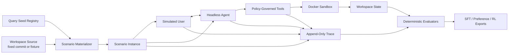

<div align="center">

# Easy Agentic Data

**Build reproducible, verifiable agent trajectories for post-training.**

A lightweight, headless framework that lets an LLM act as a user, another LLM act as an agent,
and sandboxed tools turn their interaction into training data.

[](https://www.python.org/)
[](LICENSE)
[](tests/)
[](PLAN.md)

[Quick Start](#quick-start) · [Architecture](#architecture) · [Local Models](#local-llm-api) ·
[Documentation](#documentation)

</div>

---

Easy Agentic Data generates executable agent interaction data rather than isolated prompt-response
pairs. It binds a query seed to a reproducible workspace, runs a tool-using agent inside a
restricted environment, optionally simulates multi-turn user behavior, evaluates the resulting
state, and preserves the complete trajectory for downstream training.

```text
query seed + workspace
        |
        v
simulated user <-> headless agent <-> sandboxed tools
                                      |
                                      v
                         deterministic evaluation
                                      |
                                      v
                    SFT / preference / RL datasets
```

## Why This Project?

High-quality agent data needs more than fluent model output. It needs environments that can be
reset, tools that can be governed, outcomes that can be checked, and traces that can be replayed.

- **Environment-grounded**: Final workspace state and executable checks are the primary signals.
- **Reproducible**: Seeds, immutable environment references, model settings, and tool events are
  recorded.
- **Verification-first**: Hard failures cannot be hidden by a high model-judge score.
- **Provider-neutral**: Hosted and locally deployed OpenAI-compatible APIs share one interface.
- **Training-neutral**: Export standard JSONL for SFT, preference optimization, and RL workflows.
- **Headless by design**: No UI or browser automation is required for the core synthesis loop.

## Capabilities

| Area | Included |
| --- | --- |
| Agent runtime | Multi-turn model loop, function tools, user questions, bounded retries |
| Sandboxing | Rootless Docker, resource limits, read-only root filesystem, network policy |
| Scenario registry | Query seeds, public and hidden context, fixed environment sources |
| User simulation | Rule-based and LLM-backed simulated users |
| Tracing | Versioned append-only JSONL events, artifact storage, deterministic replay |
| Evaluation | Hidden commands, required state, forbidden state, policy integrity |
| Dataset construction | SFT, chosen/rejected preference pairs, RL and analysis exports |
| Batch execution | Persistent jobs, retries, resume, budgets, rate limits, call cache |
| Governance | Sensitive-data scanning, retention controls, leakage validation |

## Architecture



The public task context is separated from hidden user and evaluator context. Hidden answers are
never placed in agent prompts or public trace events. See the
[trace schema](docs/trace-schema.md) and [threat model](docs/threat-model.md) for the exact
boundaries.

## Quick Start

### 1. Run the reproducible demo

The core package requires only Python 3.10+ and the standard library.

```bash
git clone https://github.com/COK-ZhangZiliang/Easy-Agentic-Data.git
cd Easy-Agentic-Data

PYTHONPATH=src python3 -m easy_agentic_data.cli run \
  --config examples/minimal.json
```

The mock-backed demo writes a complete local run under `runs/local-demo/`, so it does not require
an API key or network access.

```text
runs/local-demo/
├── manifest.json
├── llm_calls.jsonl
├── tasks.jsonl
├── trajectories.jsonl
├── sft.jsonl
└── preferences.jsonl
```

### 2. Install the development command

```bash
python3 -m pip install -e '.[dev]'
ead run --config examples/minimal.json
```

### 3. Run the tests

```bash
PYTHONPATH=src python3 -m unittest discover -s tests -v
```

## Synthesis Tiers

The project separates synthesis into three tiers so smoke tests, complex synthetic trajectories,
and production-style registry rollouts are not confused with one another:

```bash
ead synthesis tiers
```

| Tier | Purpose | Default path |
| --- | --- | --- |
| `smoke` | Cheap provider and export-path checks | `ead run --config examples/minimal.json` |
| `complex_synthetic` | Multi-step agent trajectory validation without external repos | `ead synthesis complex-demo --output runs/complex-synthetic-demo` |
| `registry_backed` | Production-style query/workspace seeds in Docker | `ead synthesis real-seed-demo ...` or `ead registry import ...` then `ead agent-run ...` |

The complex synthetic tier creates a repository-like fixture, asks the simulated user for missing
requirements, reads and patches files, runs a visible test, inspects a diff, runs hidden
evaluation, and writes SFT, RL, analysis, and replayable trace artifacts:

```bash
PYTHONPATH=src python3 -m easy_agentic_data.cli synthesis complex-demo \
  --output runs/complex-synthetic-demo
```

For a real registry-backed slice, use the SWE-bench Lite dataset as the seed source. The command
downloads a small page of rows, clones the referenced GitHub repository at `base_commit` into a
local cache, imports the scenario into the registry, and keeps the gold patch and test patch hidden
from public prompts and traces:

```bash
PYTHONPATH=src python3 -m easy_agentic_data.cli synthesis real-seed-demo \
  --output runs/real-seed-demo \
  --dataset princeton-nlp/SWE-bench_Lite \
  --split dev \
  --limit 1
```

When Docker is running and a live DeepSeek key is available, add the thinking-enabled config to
produce one real model/tool trajectory. For repository-specific images built locally, pass the
content-addressed image id as `sha256:<image-id>`. The Docker sandbox exposes `/workspace` on
`PYTHONPATH`; add setup commands only for offline preparation that writes inside `/workspace`.
For Python package metadata, install editable packages into the workspace prefix rather than the
read-only container root filesystem:

```bash
export DEEPSEEK_API_KEY=...
export SSL_CERT_FILE=/path/to/trusted-ca-bundle.pem

PYTHONPATH=src python3 -m easy_agentic_data.cli synthesis real-seed-demo \
  --output runs/real-seed-demo \
  --config examples/deepseek-v4-flash-thinking.json \
  --trace runs/real-seed-demo/trace.jsonl \
  --image-digest sha256:<local-image-id> \
  --setup-command 'python -m pip install --no-deps --no-build-isolation -e . --prefix /workspace/.ead_prefix' \
  --max-agent-tokens 200000
```

## Local LLM API

Use `local_openai_compatible` with a local or private chat-completions server such as vLLM,
SGLang, llama.cpp, or an OpenAI-compatible Ollama deployment:

```bash
PYTHONPATH=src python3 -m easy_agentic_data.cli run \
  --config examples/local-openai-compatible.json
```

```json
{
  "provider": "local_openai_compatible",
  "model": "Qwen/Qwen3-8B",
  "base_url": "http://127.0.0.1:8000/v1",
  "api_key_env": null,
  "chat_completions_path": "/chat/completions"
}
```

Authentication is optional. Set `api_key_env` to an environment variable name when the endpoint
requires a Bearer token. Tool-use trajectories require the serving stack and chat template to
support OpenAI function calling.

For a hosted OpenAI-compatible endpoint:

```bash
export OPENAI_API_KEY=...
ead run --config examples/openai-compatible.json
```

### DeepSeek V4 Flash

The repository includes a configuration for DeepSeek's OpenAI-compatible API. It disables
thinking mode for routine structured generation and tool loops, reducing token use and avoiding
provider-specific reasoning context when it is not needed:

```bash
export DEEPSEEK_API_KEY=...
ead run --config examples/deepseek-v4-flash.json
```

On macOS, prefer keeping the DeepSeek key in Keychain and injecting it only for the command that
needs it. The command substitution below must not be logged with shell tracing enabled:

```bash
DEEPSEEK_API_KEY="$(security find-generic-password -a "$USER" -s deepseek-api-key -w)" \
  ead run --config examples/deepseek-v4-flash.json
```

If a managed network uses a private certificate authority, point `SSL_CERT_FILE` at an approved CA
bundle. TLS verification remains enabled:

```bash
export SSL_CERT_FILE=/path/to/trusted-ca-bundle.pem
```

DeepSeek thinking mode is supported by the client when enabled through `llm.request_body`.
Assistant `reasoning_content` is sent back during the active provider conversation because
DeepSeek requires it for continued reasoning, and assistant reasoning from generated agent
responses is preserved in raw trajectories and training exports as an explicit training signal.
Evaluator-only and hidden-context reasoning must not be mixed into agent training records. Keep
thinking disabled unless a scenario benefits from it. See the [DeepSeek API documentation](https://api-docs.deepseek.com/)
for current model and protocol details.

Use `examples/deepseek-v4-flash-thinking.json` or
`examples/deepseek-v4-pro-thinking.json` for live registry-backed coding trajectories that need
thinking mode and tool calls. The Pro config uses DeepSeek's official `deepseek-v4-pro` model name.
Both thinking configs set:

```json
{
  "thinking": {
    "type": "enabled"
  },
  "reasoning_effort": "high"
}
```

## Sandboxed Agent Runs

Agent and batch runs use rootless Docker. A scenario binds the agent query to an immutable
environment source, capability policy, hidden evaluator checks, and reset procedure.

```bash
ead registry validate --root registry/
ead registry list --root registry/

ead registry import \
  --root registry/ \
  --source examples/swe-style-seeds.jsonl \
  --format swe-bench \
  --source-name sample/swe-style \
  --split train \
  --license MIT

ead agent-run \
  --registry registry/ \
  --scenario-id scenario_... \
  --config examples/local-openai-compatible.json \
  --trace runs/agent.jsonl
```

Replay a trace without calling a model or executing a tool:

```bash
ead replay --trace runs/agent.jsonl
```

### Importing Query and Workspace Seeds

The registry importer accepts local JSON or JSONL records shaped like SWE-bench, SWE-smith, and
Multi-SWE-bench exports. Each imported record creates:

- a `QuerySeed` from the issue or problem statement;
- an `EnvironmentSpec` from the repository, fixed revision, image, setup, and health metadata;
- a `Scenario` that binds the query seed to the workspace and keeps evaluator details hidden.

```bash
ead registry import \
  --root registry/ \
  --source path/to/swe-style-records.jsonl \
  --format auto \
  --source-name SWE-bench/SWE-smith \
  --split train \
  --license MIT \
  --permitted-use research
```

The importer records gold patches and test patches as hidden source references plus SHA-256
hashes. It does not place raw reference patches or hidden test IDs in public scenario views.
If a source provides test identifiers instead of executable commands, keep them in evaluator
metadata or provide a safe command template such as
`--test-command-template 'python -m pytest {test}'` for compatible repositories.

### Docker on macOS

The validated macOS setup uses Docker CLI with Colima:

```bash
brew install docker colima
colima start --cpu 2 --memory 4 --disk 20 --vm-type vz

EAD_RUN_DOCKER_TESTS=1 PYTHONPATH=src \
  python3 -m unittest tests.test_docker_integration -v
```

`MemorySandbox` is used by unit tests for speed. It is not a production security boundary.

Paid live-provider tests are opt-in and never run by default:

```bash
EAD_RUN_LIVE_LLM_TESTS=1 EAD_RUN_DOCKER_TESTS=1 \
DEEPSEEK_API_KEY=... PYTHONPATH=src \
  python3 -m unittest tests.test_live_llm_integration -v
```

## Batch Synthesis

The persistent scheduler supports idempotent jobs, retries, interrupted-run recovery, budgets,
rate limits, health checks, and cached model calls.

```bash
ead batch enqueue \
  --registry registry/ \
  --database runs/jobs.sqlite3 \
  --model local-model \
  --config-hash config-v1 \
  --rollouts 4

ead batch run \
  --registry registry/ \
  --database runs/jobs.sqlite3 \
  --config examples/local-openai-compatible.json \
  --trace-directory runs/traces

ead batch status --database runs/jobs.sqlite3
```

For a 50-trace DeepSeek V4 Pro pilot on real registry-backed workspaces, first prepare 50 fixed
seed/workspace pairs, enqueue one rollout per scenario, run with a conservative single worker, and
write a quality report plus a deterministic human-review sample:

```bash
export DEEPSEEK_API_KEY=...
export SSL_CERT_FILE=/path/to/trusted-ca-bundle.pem

PYTHONPATH=src python3 -m easy_agentic_data.cli synthesis real-seed-demo \
  --output runs/ds-v4-pro-pilot-50 \
  --dataset princeton-nlp/SWE-bench_Lite \
  --split dev \
  --limit 50

PYTHONPATH=src python3 -m easy_agentic_data.cli batch enqueue \
  --registry runs/ds-v4-pro-pilot-50/registry \
  --database runs/ds-v4-pro-pilot-50/jobs.sqlite3 \
  --model deepseek-v4-pro \
  --config-hash deepseek-v4-pro-thinking-v1 \
  --rollouts 1

PYTHONPATH=src python3 -m easy_agentic_data.cli batch run \
  --registry runs/ds-v4-pro-pilot-50/registry \
  --database runs/ds-v4-pro-pilot-50/jobs.sqlite3 \
  --config examples/deepseek-v4-pro-thinking.json \
  --trace-directory runs/ds-v4-pro-pilot-50/traces \
  --max-workers 1 \
  --max-jobs 50 \
  --max-agent-tokens 250000

PYTHONPATH=src python3 -m easy_agentic_data.cli batch report \
  --database runs/ds-v4-pro-pilot-50/jobs.sqlite3 \
  --trace-directory runs/ds-v4-pro-pilot-50/traces \
  --output runs/ds-v4-pro-pilot-50/quality-report.json \
  --review-sample runs/ds-v4-pro-pilot-50/review-sample.jsonl \
  --sample-size 10

PYTHONPATH=src python3 -m easy_agentic_data.cli batch audit-traces \
  --database runs/ds-v4-pro-pilot-50/jobs.sqlite3 \
  --trace-directory runs/ds-v4-pro-pilot-50/traces \
  --output runs/ds-v4-pro-pilot-50/trace-logic-audit.json
```

When the key is stored in macOS Keychain, inject it for the paid batch command without writing it
to shell startup files, tracked configs, logs, or run artifacts:

```bash
DEEPSEEK_API_KEY="$(security find-generic-password -a "$USER" -s deepseek-api-key -w)" \
SSL_CERT_FILE=/path/to/trusted-ca-bundle.pem \
PYTHONPATH=src python3 -m easy_agentic_data.cli batch run \
  --registry runs/ds-v4-pro-pilot-50/registry \
  --database runs/ds-v4-pro-scale-candidates/jobs.sqlite3 \
  --config examples/deepseek-v4-pro-thinking.json \
  --trace-directory runs/ds-v4-pro-scale-candidates/traces \
  --max-workers 2 \
  --job-id-file runs/ds-v4-pro-scale-candidates/estimate.json \
  --shard-index 0 \
  --max-agent-tokens 350000 \
  --max-agent-seconds 1200
```

Before scaling a paid provider run, select scenario groups that showed enough executable signal in
the pilot instead of blindly amplifying every imported seed. The selector reports per-scenario
success, hidden-test, agent-stop, infrastructure, token, and tool-call rates, then writes the
scenario IDs that satisfy the configured thresholds:

```bash
PYTHONPATH=src python3 -m easy_agentic_data.cli batch select-scale-candidates \
  --database runs/ds-v4-pro-pilot-50/jobs.sqlite3 \
  --audit runs/ds-v4-pro-pilot-50/trace-logic-audit.json \
  --output runs/ds-v4-pro-pilot-50/scale-candidates.json \
  --min-rollouts 2 \
  --min-success-rate 0.5 \
  --min-hidden-command-pass-rate 0.5 \
  --min-all-non-agent-pass-rate 0.5 \
  --min-agent-stop-rate 0.5 \
  --min-high-quality-rate 0.5 \
  --min-closed-loop-rate 0.8 \
  --min-multi-step-complex-rate 0.8 \
  --min-average-tool-calls 6
```

Use the selection file when creating the larger queue so low-signal or environment-noisy scenario
groups do not consume the scale-up budget:

```bash
PYTHONPATH=src python3 -m easy_agentic_data.cli batch enqueue \
  --registry runs/ds-v4-pro-pilot-50/registry \
  --database runs/ds-v4-pro-scale-candidates/jobs.sqlite3 \
  --model deepseek-v4-pro \
  --config-hash deepseek-v4-pro-thinking-scale-v1 \
  --rollouts 20 \
  --selection-file runs/ds-v4-pro-pilot-50/scale-candidates.json
```

Estimate the queued scale-up before starting paid requests. The estimate uses observed pilot token
usage per scenario and writes deterministic shards with explicit job IDs:

```bash
PYTHONPATH=src python3 -m easy_agentic_data.cli batch estimate-scale \
  --database runs/ds-v4-pro-scale-candidates/jobs.sqlite3 \
  --pilot-database runs/ds-v4-pro-pilot-50/jobs.sqlite3 \
  --output runs/ds-v4-pro-scale-candidates/estimate.json \
  --shard-size 20
```

Check a shard before and after running it:

```bash
PYTHONPATH=src python3 -m easy_agentic_data.cli batch shard-status \
  --database runs/ds-v4-pro-scale-candidates/jobs.sqlite3 \
  --job-id-file runs/ds-v4-pro-scale-candidates/estimate.json \
  --shard-index 0 \
  --output runs/ds-v4-pro-scale-candidates/shard-0-status.json
```

Preview the exact pending jobs before approving provider spend. Dry runs only read the scheduler and
selection files; they do not load provider configuration, create Docker sandboxes, or call the
model:

```bash
PYTHONPATH=src python3 -m easy_agentic_data.cli batch run \
  --registry runs/ds-v4-pro-pilot-50/registry \
  --database runs/ds-v4-pro-scale-candidates/jobs.sqlite3 \
  --config examples/deepseek-v4-pro-thinking.json \
  --trace-directory runs/ds-v4-pro-scale-candidates/traces \
  --max-workers 2 \
  --job-id-file runs/ds-v4-pro-scale-candidates/estimate.json \
  --shard-index 0 \
  --max-agent-tokens 350000 \
  --max-agent-seconds 1200 \
  --dry-run
```

After reviewing the estimate and approving provider spend, run one exact shard at a time:

```bash
PYTHONPATH=src python3 -m easy_agentic_data.cli batch run \
  --registry runs/ds-v4-pro-pilot-50/registry \
  --database runs/ds-v4-pro-scale-candidates/jobs.sqlite3 \
  --config examples/deepseek-v4-pro-thinking.json \
  --trace-directory runs/ds-v4-pro-scale-candidates/traces \
  --max-workers 2 \
  --job-id-file runs/ds-v4-pro-scale-candidates/estimate.json \
  --shard-index 0 \
  --max-agent-tokens 350000 \
  --max-agent-seconds 1200
```

Then report only that shard before deciding whether to continue:

```bash
PYTHONPATH=src python3 -m easy_agentic_data.cli batch report \
  --database runs/ds-v4-pro-scale-candidates/jobs.sqlite3 \
  --trace-directory runs/ds-v4-pro-scale-candidates/traces \
  --output runs/ds-v4-pro-scale-candidates/quality-report-shard-0.json \
  --review-sample runs/ds-v4-pro-scale-candidates/review-sample-shard-0.jsonl \
  --overwrite-review-sample \
  --sample-size 10 \
  --job-id-file runs/ds-v4-pro-scale-candidates/estimate.json \
  --shard-index 0

PYTHONPATH=src python3 -m easy_agentic_data.cli batch audit-traces \
  --database runs/ds-v4-pro-scale-candidates/jobs.sqlite3 \
  --trace-directory runs/ds-v4-pro-scale-candidates/traces \
  --output runs/ds-v4-pro-scale-candidates/trace-logic-audit-shard-0.json \
  --job-id-file runs/ds-v4-pro-scale-candidates/estimate.json \
  --shard-index 0
```

Gate the next shard on the completed shard's status and quality:

```bash
PYTHONPATH=src python3 -m easy_agentic_data.cli batch decide-continuation \
  --report runs/ds-v4-pro-scale-candidates/quality-report-shard-0.json \
  --status runs/ds-v4-pro-scale-candidates/shard-0-status.json \
  --audit runs/ds-v4-pro-scale-candidates/trace-logic-audit-shard-0.json \
  --min-high-quality-rate 0.5 \
  --min-closed-loop-rate 0.8 \
  --min-multi-step-complex-rate 0.8 \
  --output runs/ds-v4-pro-scale-candidates/decision-shard-0.json
```

For a single review artifact before spending on a shard, combine the pilot selection, queue
estimate, shard status, trace audit, and continuation decision. A clean pre-run shard reports
`pre_run_ready: true`; a completed shard that clears the quality gates reports
`continuation_ready: true`:

```bash
PYTHONPATH=src python3 -m easy_agentic_data.cli batch scale-readiness \
  --selection runs/ds-v4-pro-pilot-50/scale-candidates.json \
  --estimate runs/ds-v4-pro-scale-candidates/estimate.json \
  --status runs/ds-v4-pro-scale-candidates/shard-0-status.json \
  --audit runs/ds-v4-pro-scale-candidates/trace-logic-audit-shard-0.json \
  --decision runs/ds-v4-pro-scale-candidates/decision-shard-0.json \
  --output runs/ds-v4-pro-scale-candidates/readiness-shard-0.json
```

## Data Outputs

| Artifact | Purpose |
| --- | --- |
| `manifest.json` | Run configuration, provenance, and aggregate statistics |
| `llm_calls.jsonl` | Prompt hashes, model parameters, usage, latency, retries, and status |
| `tasks.jsonl` | Generated and evolved task blueprints |
| `trajectories.jsonl` | Complete conversations, tool events, and verification results |
| `sft.jsonl` | Highest-reward accepted trajectory for each task |
| `preferences.jsonl` | Chosen/rejected pairs with a positive deterministic margin |

Raw trajectories are preserved. Export stages create derived views and never rewrite the source
trace in place.

## Project Layout

```text
src/easy_agentic_data/
├── agent/             # Headless agent runtime
├── environments/      # Reproducible environment contracts
├── llm/               # Hosted, local, observed, and mock model clients
├── sandbox/           # Docker and in-memory sandbox backends
├── seeds/             # Query seed and hidden/public context contracts
├── traces/            # Event schema, artifact store, recorder, and replay
├── batch.py           # Persistent synthesis scheduler
├── coding_tools.py    # Sandboxed coding-tool implementations
├── evaluation.py      # Deterministic trajectory and state evaluation
├── generation.py      # Task generation and difficulty evolution
├── governance.py      # Sensitive-data and retention controls
├── registry.py        # Scenario storage, validation, and materialization
├── real_seed_sources.py # Real seed download, repository clone, and registry preparation
├── registry_sources.py # External SWE-style seed-source import adapters
├── simulation.py      # Simulated user implementations
├── synthesis_tiers.py # Smoke, complex synthetic, and registry-backed synthesis paths
└── trace_exporters.py # SFT, preference, RL, and analysis exports
```

## Documentation

- [Research and design](docs/research-and-design.md): synthesis approaches and adopted design
- [Implementation plan](PLAN.md): milestones, exit criteria, and progress
- [Development contract](AGENTS.md): engineering, testing, documentation, and Git rules
- [Trace schema](docs/trace-schema.md): event contracts and migration policy
- [Sandbox ADR](docs/adr-0001-docker-sandbox.md): Docker isolation decision
- [RL episode ADR](docs/adr-0002-rl-episode-export.md): action/loss-mask export contract
- [Synthesis tiers ADR](docs/adr-0003-synthesis-tiers.md): smoke, complex synthetic, and registry-backed contract
- [Threat model](docs/threat-model.md): trust boundaries, risks, and controls

## Development Status

Easy Agentic Data is in early development. The core vertical slice is implemented and tested:
scenario materialization, sandboxed agent execution, simulated users, trace replay, deterministic
evaluation, dataset exports, and recoverable batch synthesis. Interfaces may still evolve before
the first stable release.

Contributions should follow [AGENTS.md](AGENTS.md). Every functional change must include relevant
tests, and all repository documentation and code comments must be written in English.

## License

Licensed under the [Apache License 2.0](LICENSE).
